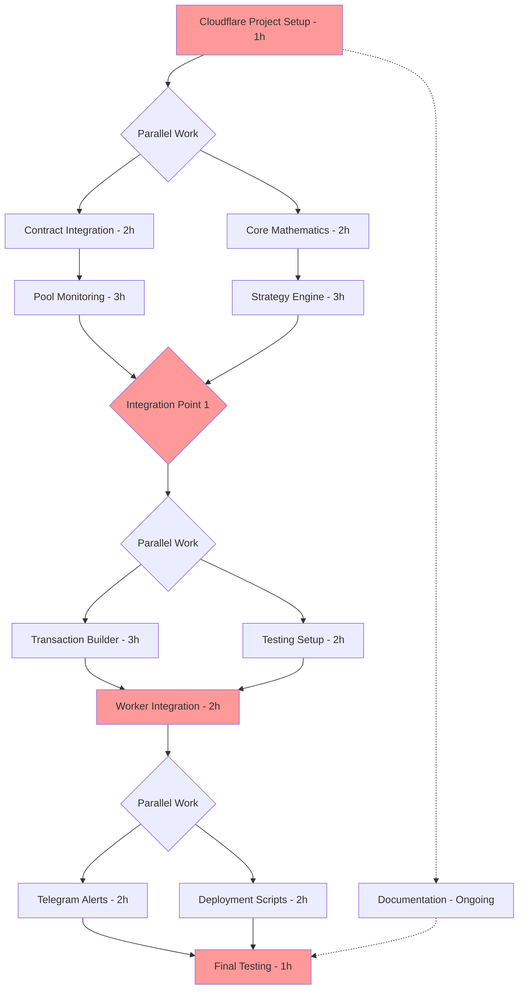

# Team Collaboration Plan - Cloudflare Workers Edition

## Overview
This plan is optimized for building a Uniswap v3 LP monitoring bot using Cloudflare Workers, KV, and R2.

## Key Architecture Changes from AWS
- **Cloudflare Workers** instead of Lambda
- **KV Namespace** instead of DynamoDB  
- **R2 Storage** instead of S3
- **Cron Triggers** instead of EventBridge
- **Wrangler** instead of AWS CLI

## Team Structure (2-Person Team)

### Developer A: Infrastructure & Integration
- Cloudflare setup and deployment
- Contract integration
- Pool monitoring
- Transaction building
- Telegram notifications

### Developer B: Core Logic & Testing
- Mathematics implementation
- Strategy engine
- Testing infrastructure
- Worker runtime
- Documentation

## Task Dependency Diagram



## Parallel Work Optimization

### What Can Be Done in Parallel:
1. **Contract Integration** & **Core Math** (no dependencies)
2. **Pool Monitoring** & **Strategy Engine** (both need their base components)
3. **Transaction Builder** & **Testing Setup** (independent tasks)
4. **Telegram Alerts** & **Deployment Scripts** (separate concerns)

### What Must Be Sequential:
1. Project setup → Everything else
2. Core components → Integration
3. Integration → Final testing

## Hour-by-Hour Schedule

### Saturday (Day 1)

| Hour | Developer A | Developer B |
|------|-------------|-------------|
| 9:00 | Cloudflare project setup (together) | Cloudflare project setup (together) |
| 10:00 | Contract Integration | Core Mathematics |
| 11:00 | Contract Integration | Core Mathematics |
| 12:00 | *Lunch Break* | *Lunch Break* |
| 13:00 | Pool Monitoring | Strategy Engine |
| 14:00 | Pool Monitoring | Strategy Engine |
| 15:00 | Pool Monitoring | Strategy Engine |
| 16:00 | Integration sync & test | Integration sync & test |
| 17:00 | Review & plan Day 2 | Review & plan Day 2 |

### Sunday (Day 2)

| Hour | Developer A | Developer B |
|------|-------------|-------------|
| 9:00 | Transaction Builder | Testing Infrastructure |
| 10:00 | Transaction Builder | Testing Infrastructure |
| 11:00 | Transaction Builder | Worker Runtime Setup |
| 12:00 | *Lunch Break* | *Lunch Break* |
| 13:00 | Worker Integration (together) | Worker Integration (together) |
| 14:00 | Telegram Alerts | Deployment Scripts |
| 15:00 | Telegram Alerts | Documentation |
| 16:00 | Final Testing (together) | Final Testing (together) |
| 17:00 | Deployment & Verification | Deployment & Verification |

## Cloudflare-Specific Considerations

### 1. Worker Limits to Keep in Mind
```typescript
// BAD: Long-running operation
async function complexCalculation() {
  // 30-second CPU limit!
  for (let i = 0; i < 1000000; i++) {
    // ...
  }
}

// GOOD: Efficient operations
async function efficientCheck() {
  const [poolState, positionState] = await Promise.all([
    getPoolState(),
    getPositionState()
  ]);
  return evaluateStrategy(poolState, positionState);
}
```

### 2. State Management Pattern
```typescript
// KV for current state (fast reads)
await env.LP_BOT_KV.put('current:state', JSON.stringify(state));

// R2 for historical data (cheap storage)
await env.lp_bot_historical.put(`history/${date}.json`, JSON.stringify(snapshot));
```

### 3. Local Development Setup
```bash
# Both developers need:
npm install -g wrangler
wrangler login

# Local development
wrangler dev --local

# Testing with Miniflare
npm test
```

## Interface Contracts

### Between Pool Monitor and Strategy
```typescript
interface MonitoringResult {
  poolState: {
    tick: number;
    sqrtPriceX96: bigint;
    liquidity: bigint;
    feeGrowthGlobal0X128: bigint;
    feeGrowthGlobal1X128: bigint;
  };
  positionState: {
    tokenId: string;
    tickLower: number;
    tickUpper: number;
    liquidity: bigint;
    tokensOwed0: bigint;
    tokensOwed1: bigint;
    isInRange: boolean;
  };
}
```

### Between Strategy and Transaction Builder
```typescript
interface RebalanceDecision {
  shouldRebalance: boolean;
  reason: string;
  newRange: { tickLower: number; tickUpper: number };
  estimatedFees: { token0: number; token1: number; totalUsd: number };
  estimatedGasCost: number;
  profitMultiple: number;
}
```

### Between Worker and Storage
```typescript
interface StorageAPI {
  // KV Operations
  saveCurrentState(state: any): Promise<void>;
  getCurrentState(): Promise<any>;
  
  // R2 Operations  
  saveSnapshot(snapshot: any): Promise<void>;
  getHistoricalData(startDate: Date, endDate: Date): Promise<any[]>;
}
```

## Git Workflow for Cloudflare Project

### Branch Structure
```
main
├── feature/cloudflare-setup (Both)
├── feature/contracts (Dev A)
├── feature/math (Dev B)
├── feature/monitoring (Dev A)
├── feature/strategy (Dev B)
├── feature/transactions (Dev A)
├── feature/testing (Dev B)
├── feature/alerts (Dev A)
└── feature/deployment (Dev B)
```

### Deployment Process
```bash
# Dev environment
wrangler deploy --env dev

# Staging
wrangler deploy --env staging

# Production (after testing)
wrangler deploy --env production
```

## Communication Protocol

### Key Sync Points
1. **After Project Setup** (Hour 1)
   - Confirm wrangler.toml configuration
   - Verify KV and R2 bindings
   
2. **After Core Components** (Hour 4)
   - Review interfaces
   - Test integration points

3. **Before Worker Integration** (Day 2, Hour 4)
   - Combine all components
   - Resolve any conflicts

4. **Before Deployment** (Final hour)
   - Run full test suite
   - Verify all secrets set

## Testing Strategy

### Local Testing with Miniflare
```typescript
// test/setup.ts
import { Miniflare } from 'miniflare';

const mf = new Miniflare({
  script: './src/index.ts',
  kvNamespaces: ['LP_BOT_KV'],
  r2Buckets: ['lp_bot_historical'],
  crons: ['*/5 * * * *']
});
```

### Integration Testing Checklist
- [ ] Worker responds to cron trigger
- [ ] KV read/write operations work
- [ ] R2 storage functions correctly
- [ ] RPC calls complete within timeout
- [ ] Telegram notifications sent
- [ ] Error handling works

## Deployment Checklist

### Pre-Deployment (Both Developers)
1. [ ] All tests passing locally
2. [ ] Secrets configured in Cloudflare
3. [ ] KV namespace created
4. [ ] R2 bucket created
5. [ ] Telegram webhook configured

### Deployment Steps
```bash
# 1. Create KV namespace
wrangler kv:namespace create "LP_BOT_KV"

# 2. Create R2 bucket  
wrangler r2 bucket create lp-bot-historical

# 3. Set secrets
wrangler secret put TELEGRAM_BOT_TOKEN
wrangler secret put ARBITRUM_RPC

# 4. Deploy worker
wrangler deploy

# 5. Verify cron trigger
wrangler tail
```

### Post-Deployment Verification
- [ ] Worker executing on schedule
- [ ] State being saved to KV
- [ ] Historical data in R2
- [ ] Telegram alerts working
- [ ] No errors in logs

## Risk Mitigation

### Cloudflare-Specific Risks
1. **30-second execution limit**
   - Mitigation: Optimize RPC calls, use Promise.all
   
2. **KV eventual consistency**
   - Mitigation: Design for eventual consistency
   
3. **Rate limits**
   - Mitigation: Implement exponential backoff

4. **Deployment failures**
   - Mitigation: Test thoroughly, use staging environment

## Success Metrics

### Technical Success
- [ ] Executes in <5 seconds average
- [ ] Zero failed executions in 24 hours  
- [ ] Accurate position monitoring
- [ ] Timely notifications

### Team Success
- [ ] Both developers can deploy independently
- [ ] Clear documentation written
- [ ] Knowledge shared effectively
- [ ] MVP completed in weekend

## Tools & Resources

### Required Tools
- Wrangler CLI
- Node.js 18+
- Git
- Telegram account

### Helpful Resources
- [Cloudflare Workers Docs](https://developers.cloudflare.com/workers/)
- [Wrangler Documentation](https://developers.cloudflare.com/workers/wrangler/)
- [KV Storage Guide](https://developers.cloudflare.com/workers/runtime-apis/kv/)
- [Cron Trigger Reference](https://developers.cloudflare.com/workers/configuration/cron-triggers/)

## Estimated Timeline

With 2 developers working in parallel:
- **Total time**: ~10 hours of active development
- **Day 1**: 8 hours (setup through integration)
- **Day 2**: 8 hours (features through deployment)
- **Actual working time**: 10-12 hours (including breaks)

This is 6-8 hours faster than solo development!